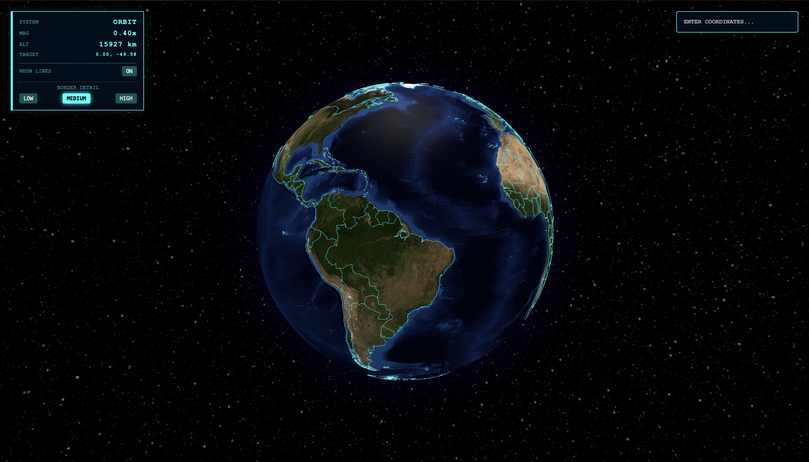

## 🚀 Tech Stack

# Dual_layer_earth-Three_j_s

Deep Zoom: Final Unified Build

Deep Zoom is a highly interactive 3D globe and map visualization web app built with Three.js Globe and MapLibre GL. It allows seamless transitions between an orbital view of Earth and detailed street-level maps, combining rich graphical effects with real-time geographic data.

Features
	•	Interactive 3D Globe: Smooth orbiting and auto-rotation with detailed country polygons.
	•	Surface Map Mode: High-resolution MapLibre maps with terrain and satellite layers.
	•	Dynamic HUD: Heads-up display shows zoom level, altitude, target coordinates, and current mode.
	•	Neon Border Effects: Toggle country border highlights for aesthetic visualization.
	•	Detail Levels: Switch between Low, Medium, and High polygon detail for performance tuning.
	•	Smooth Transitions: Automatic crossfade between globe and map depending on zoom level.
	•	Search Functionality: Enter coordinates or place names to navigate instantly.
	•	Loading Feedback: System sync indicator for improved UX.

Tech Stack
	•	Three.js Globe
	•	MapLibre GL
	•	HTML5, CSS3, JavaScript (ES6)

Usage
	1.	Run start.sh or Open index.html in a browser.
	2.	Use the HUD controls to toggle neon lines or change polygon detail.
	3.	Enter coordinates in the search bar to jump to a location.
	4.	Zoom in/out to transition between orbital and map views seamlessly.

